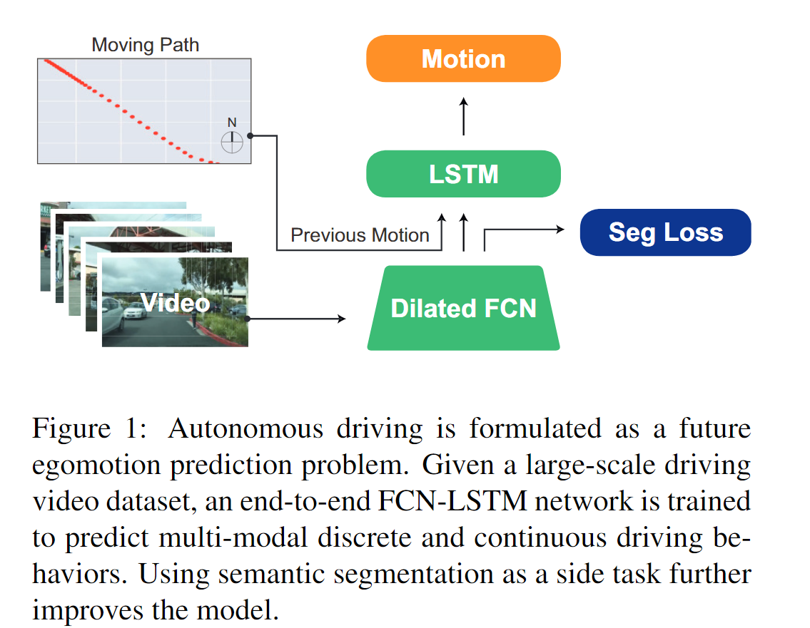
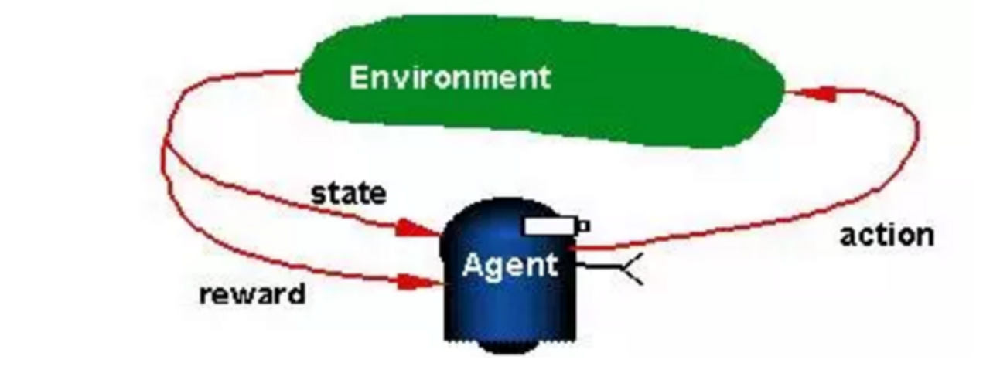
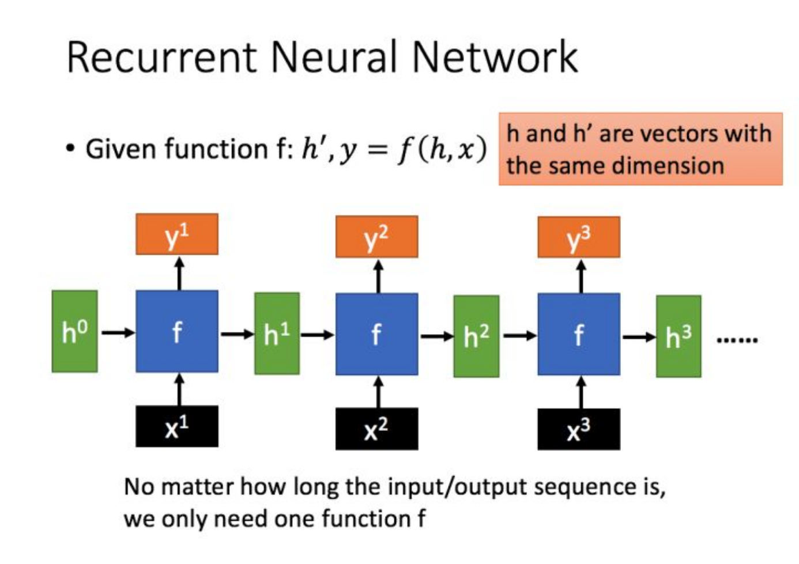
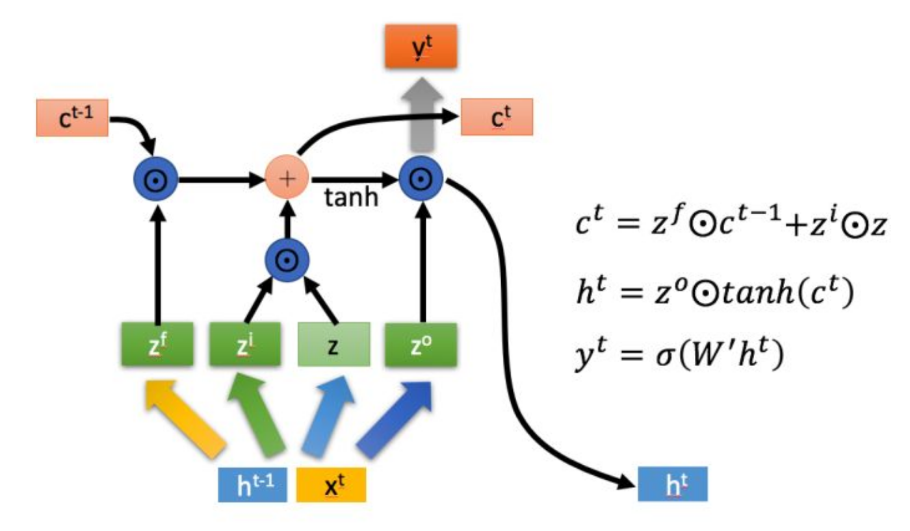
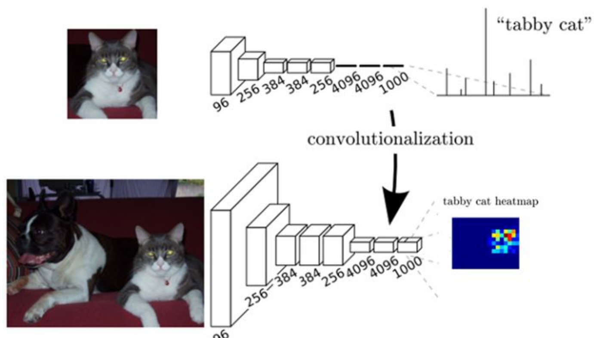
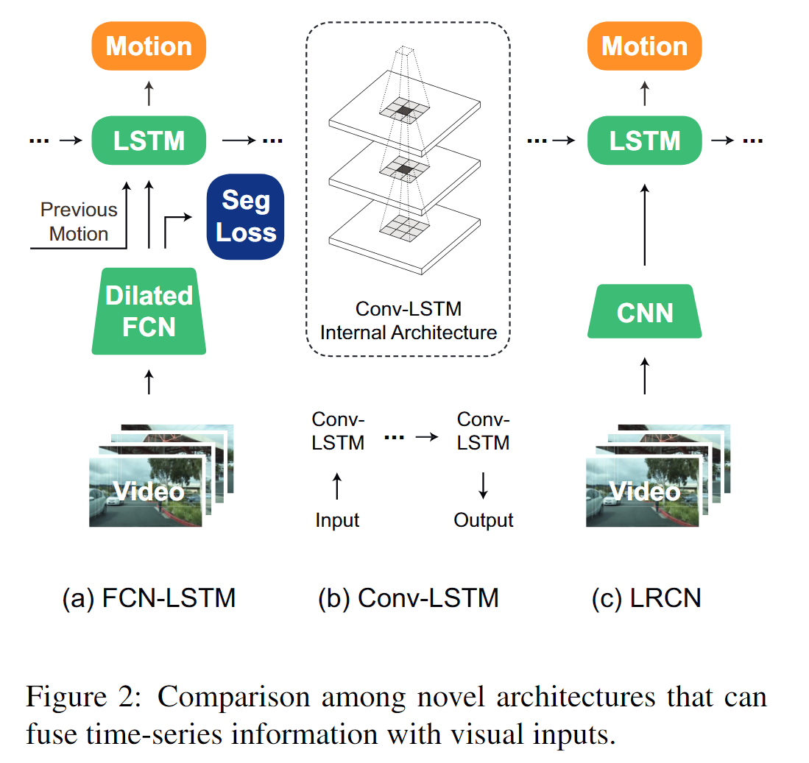
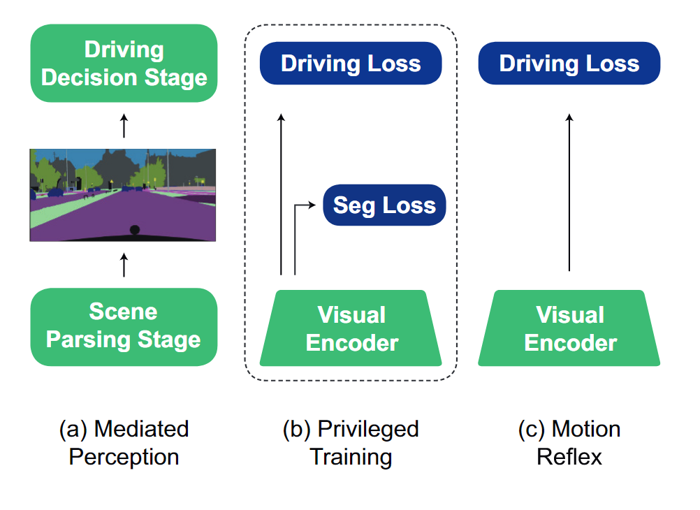

# End-to-end Learning of Driving Models from Large-scale Video Datasets笔记

论文来源：[End-to-end Learning of Driving Models from Large-scale Video Datasets](https://arxiv.org/pdf/1612.01079.pdf)

项目地址：[gy20073/BDD_Driving_Model](https://github.com/ gy20073/BDD_Driving_Model/ )

时间：2019/5/18

------

## 一、主要工作

本篇论文提出了一个通用的驾驶模型（generic vehicle motion model），这个模型采用**end-to-end**的架构，可以根据**即时的感知信息**和**之前的驾驶状态**预测出vehicle位置的**概率分布**

这个模型是在大规模的没有经过校准的video数据中训练得到的，类似于一个language model，它通过train和evaluate以确保能够尽可能地输出类似于所观察到的驾驶**序列行为**。因为它输出的是一个状态相关的action的概率分布，所以它也是一个policy

这篇paper中主要提出了四个创新点：

1. 这个模型是**通用**（generic）的，它在当前的agent state基础上预测未来的path location，不需要使用特殊的校准过的数据集
2. 提出了一个**FCN-LSTM**架构，可以联合的从demonstration loss（main task）和segmentation loss（side loss）进行学习，并输出多模态的预测记过
3. 制作并开源了一个大规模的**数据集**
4. 实验证明了，在预测egomotion（vehicle自身的运动）时使用**side task loss**进行privileged training比只用main task loss快

## 二、相关知识

### 1. 与其他driving model的比较

| 方法                            | 特点                                                        | 缺点                                                         |
| ------------------------------- | ----------------------------------------------------------- | ------------------------------------------------------------ |
| pixels-> action                 | 证明了神经网络在自动驾驶方面的使用潜力                      | 1. previous方法只能处理简单场景（障碍少，路口少）2. previous方法对数据要求比较高，需要进行特殊校准 |
| pixels-> measures               | 输出的不是直接的action，而是中介的表示（eg.和周围车的距离） | 1. 在复杂场景中这种measures很难定义 2.需要人为的将measures转化为action，很费劲 |
| treat as visual prediction task | 输出的是video中下一帧的驾驶画面                             | visual prediction不受car action的约束                        |

### 2. Reinforcement Learning

资料来源：

- [模型汇总18 强化学习（Reinforcement Learning）基础介绍](https://zhuanlan.zhihu.com/p/27860483)
- [深度强化学习（Deep Reinforcement Learning）入门：RL base & DQN-DDPG-A3C introduction](https://zhuanlan.zhihu.com/p/25239682)

强化学习（Reinforcement Learning）是与监督/非监督学习（Supervised/Unsupervised Learning）并列的学习方法，按照我的简单理解来看：

- **监督学习**：已知ground truth，直接尝试从input学到output
- **非监督学习**：没有ground truth，根据input内部的特征通过聚类等方法输出结果
- **强化学习**：每一次输出都会收到反馈结果（奖励/惩罚），在与环境的不断交互中学习

强化学习的基本模型如下：

Agent能基于环境的状态state和环境对上一次行动的反馈reward，根据某种策略policy选择新的动作action

本文中用到的不是RL的模型，但是可以作为一个对比，因为都有state和action，但RL有reward。

### 3. LSTM

资料来源：[人人都能看懂的LSTM](https://zhuanlan.zhihu.com/p/32085405)

**循环神经网络（Recurrent Neural Network，RNN）**是一种用于处理序列数据的神经网络，它的特点在于上一次的输出结果会作为输入对这一次的输出产生影响：

**长短期记忆（Long short-term memory, LSTM）**是一种特殊的RNN，它保存了两个状态，除了RNN中也有的cell state（RNN中的$h_t$，LSTM中的$c_t$）之外，还保留了hidden state（LSTM中的$h_t$）

上图中的几个z都是对应计算得到的不同的数值（0~1之间），起一种门控的作用：

- $z_f$（forget）：控制对上一阶段的输入进行选择性遗忘
- $z_i$（information）：控制对这一阶段的输入进行选择性记忆
- $z_o$（output）：控制对当前状态的输出

LSTM通过门控状态来控制传输状态，记住需要长时间记忆的，忘记不重要的信息，在比较长的序列数据中有更好的表现。

### 4. FCN

资料来源：[全卷积网络 FCN 详解](https://zhuanlan.zhihu.com/p/30195134)

简单来说，FCN就是把CNN最后的全连接层换成卷积层：

对比

- CNN输出的是一个特征向量，对应图片在每一个class上的概率

- FCN输出的是与原始图片大小相同，有CLASSNUM个channel的图片（第K个channel中某像素的值就是这个像素分类为Kth class的概率）

FCN保留了图片的空间信息，实现了像素级别的分类，从而解决了语义分割问题

## 三、具体工作

### 1. Generic Driving Model

核心思想：根据previous observation（上一状态）和vehicle state（当前状态）来预测future action
$$
F(s,a)=S\times A \rightarrow R \\
F:driving\ model\\
s:state\\
a:action
$$
$F(s,a)$评估了在state $s$下采取action $a$的合理性：

- 输入：raw pixels（visual cue），current vehicle state ，prior vehicle state
- 输出：future motion的概率分布

### 2. FCN-LSTM Architecture

#### 2.1 Visual Encoder

- 使用膨胀的全卷积网络（dilated FCN ）来提取感知信息
- 针对这个encoder计算一个seg loss，通过和main task联合训练从而不断finetune

#### 2.2 Temporal Fusion

- 选择性的并入一些sensor data（速度，角速度，etc.）
- 使用LSTM来把序列的state与当前state进行整合
- 使用一个全连接层来预测物理可行性

### 3. Driving Perplexity

在整个时间序列$t$内，第$i$个action的合理性由$F(s_i,a_i)$表示，那么可以用一个二阶交叉熵损失来表示整个序列的预测结果的perplexity ：
$$
perplexity=exp\{-\frac{1}{t}\sum_{i-1}^tlogF(s_i,a_i)\}
$$
通过比较$\max F(s,a)$时的$a$与ground truth，就可以检验model的预测可靠性

### 4. Action Prediction（没看懂）

区分两种action：

- discrete（离散的） action：被表示为几种不同的action（eg.左转、右转，直行）,这样的问题在于，由于数据集中大部分都是选择执行，就会导致model无脑选直行
- continuous（连续的） action：可以定义一个参数分布族，然后通过回归来得到参数的分布；也可以使用非参数的方法，比如把action space离散成很多个bin

### 5. Driving with Privileged Information

在visual encodeing阶段通过FCN得到了一个语义分割的结果，这个segmentation信息被用作*“privileged information”*，起到额外监督的效果

- （a）是将像素级别的label信息作为Driving的输入，完全依赖语义分割的结果
- （c）是把raw pixel作为Driving的输入，完全依赖原始图像信息
- （b）把语义分割作为一个side task，和main task一起训练，附加了一个监督的作用