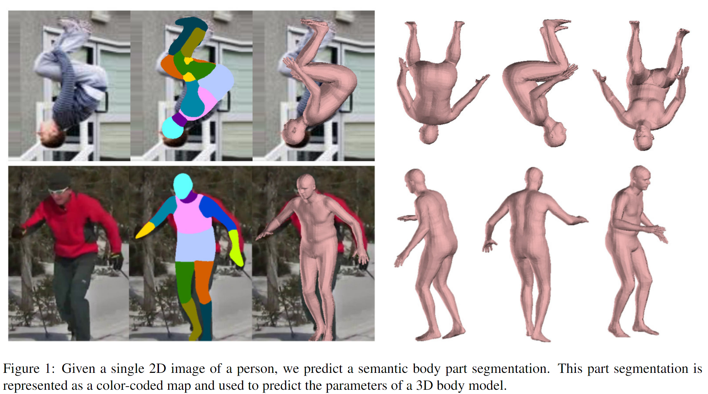
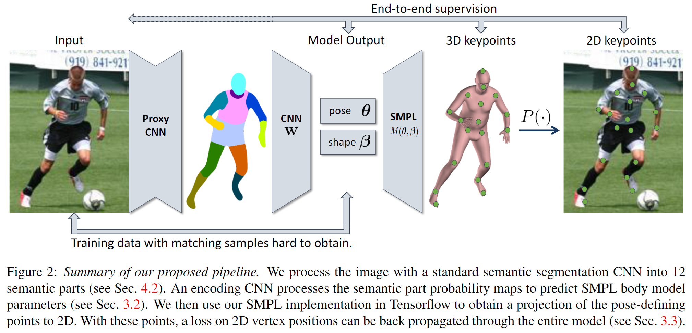

# Neural Body Fitting: Unifying Deep Learning and Model-Based Human Pose and Shape Estimation学习笔记

时间：2019/1/26

论文来源：[Neural Body Fitting: Unifying Deep Learning and Model-Based Human Pose and Shape Estimation]( http://github.com/mohomran/)

------

## 一. 主要工作

论文中提出了一个用于预测3D模型的pose和shape参数的框架**NBF（Neural Body Fitting）** 。NBF将3D模型和CNN相结合，利用了语义分割（semantic segmentation）技术，可以进行细粒度的全面的模型fitting。同时提供3D和2D的监督方法，可以根据可用数据集的情况灵活训练。

论文还探究了使用原始图片或是其中间表示（剪影，分割，关节etc）对3D预测的影响，进一步探究了语义分割的质量对预测准确度的影响

------

## 二. Human pose estimation - 3D method

现有的根据image推测3D参数的方法主要有两类：**基于模型的（Model-based Methods）** 和 **基于深度学习的（Learning-Based Models） ** ：

| 类别       | Model-based Methods                                          | Learning-Based Models                                        |
| ---------- | ------------------------------------------------------------ | ------------------------------------------------------------ |
| 特征       | 使用参数化的模型或者模板，通过复杂的非线性的优化过程来使模型与image适配 | 使用回归（regression）的方法利用CNN进行预测                  |
| 利用的技术 | 2D keypoint 检测；对抗性学习；运动深度模糊；etc              | 2D keypoint 检测；语义分割；etc                              |
| 缺点       | 需要很好的initialization，当初始预测与正确预测偏离太大时，容易陷入不正确的局部最小值 | （1）需要大量的有3D标记的训练数据，但是这样的数据集是很少的（2）预测出的参数无法结合身体各部分的比例信息，会出现不自然的形状（3）难以得到完整网格的模型，只能得到火柴人 |

NFS将两种方法结合了起来，在CNN中加入了SMPL，既不需要初始化，也不需要大量训练数据

------

## 三. 具体方法

预测主要包括两个阶段：

1. 使用CNN，从原始图像中得到segmentation图像
2. 使用CNN，利用segmentation图像预测shape和pose参数，然后利用SMPL模型进行损失优化

在得到segmentation图像$I​$之后，通过一个参数为$w​$的CNN预测网络，可以得到shape参数$\beta(w,I)​$和pose参数$\theta(w,I)​$，使用这两个参数就可以生成一个SMPL模型$N_{3D}(w,I)​$:
$$
N_{3D}(w,I)=M(\theta(w,I),\beta(w,I))=M(T(\theta(w,I),\beta(w,I)),J(\beta(w,I)),\theta(w,I),W)
$$
通过对SMPL进行一个投影操作Π，就可以得到3D keypoint的2D投影$N_{2D}(w,I)$:
$$
N_{2D}(w,I)=Π(J(w,I))
$$
这样就可以得到3D和2D的两种输出，因此可以使用不同的损失函数进行训练：

1. 3D latent parameter loss：计算预测的$\theta$和$\beta$与ground truth的L1损失
2. 3D joint loss：计算预测出的SMPL的3D keypoints与ground truth的L2损失
3. 3D joint loss：计算投影得到的2D keypoints与ground truth的L2损失
4. Joint 2D and 3D loss：同时计算2. 和3.的损失，对两种维度都进行监督

------

# 四. 探究

通过探究多种因素对预测准确度的影响，发现：

1. RGB图片中的有些信息（光照，外观，服装）在预测3D的shape和pose参数时是具有干扰性的，segmentation/heatmap这种中间表示中已经包含了足够的关键信息
2. segmentation的精确性对预测的准确性有很大影响

