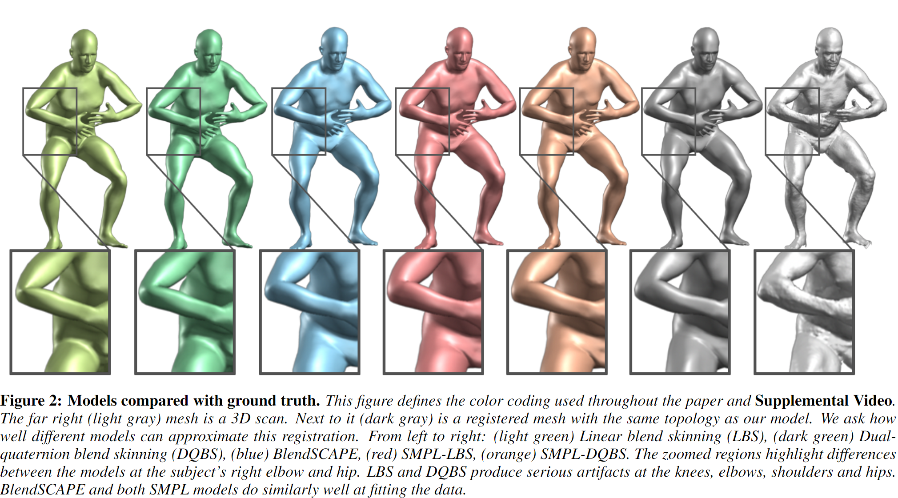
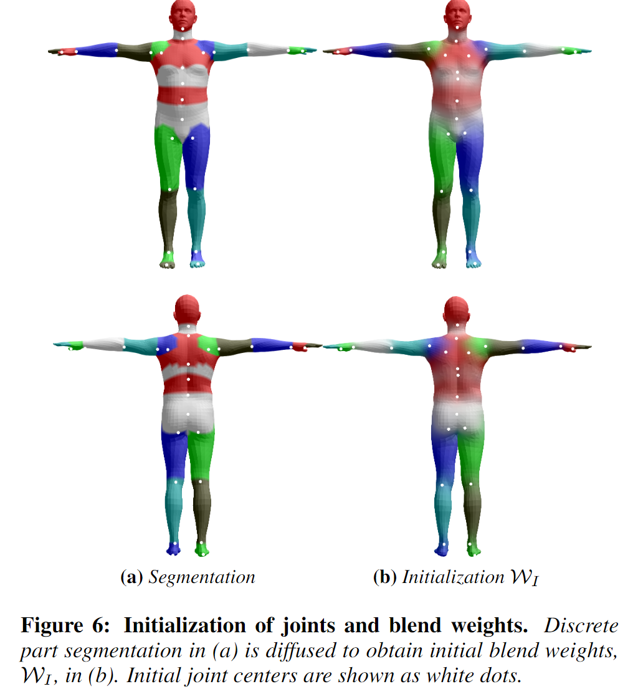
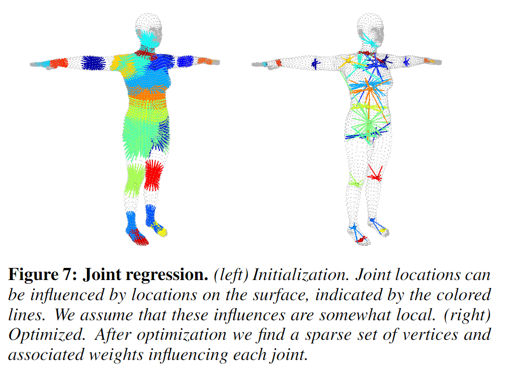
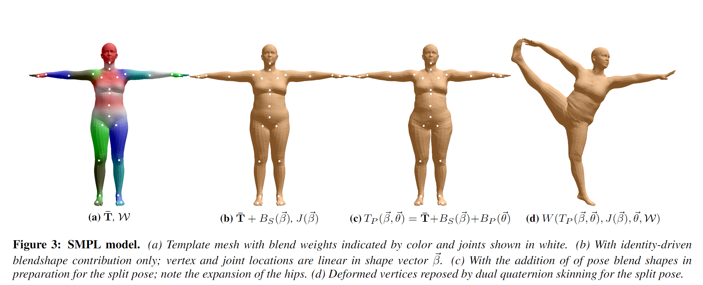
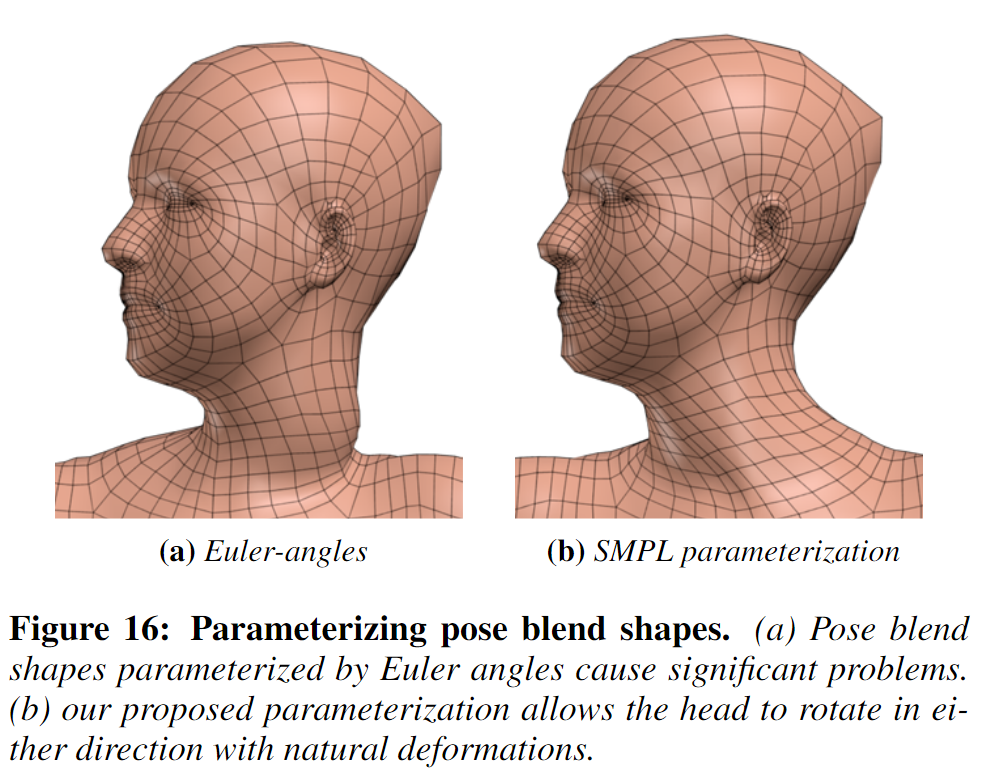

# SMPL: A Skinned Multi-Person Linear Model 学习笔记

时间：2019/1/21

论文来源：[SMPL: A Skinned Multi-Person Linear Model](https://www.researchgate.net/publication/287815055_SMPL_a_skinned_multi-person_linear_model)

------

## 一 . 主要工作

SMPL（Skinned Multi-Person Linear Model）是一种裸体的（skinned），基于顶点（vertex-based）的人体三维模型，能够精确地表示人体的不同形状（shape）和姿态（pose）。

SMPL适用于动画领域，可以随姿态变化自然的变形，并伴随软组织的自然运动。SMPL与现有的许多图形渲染管线都是兼容的。

SMPL是一种可学习的模型，通过训练可以更好地拟合人体的形状和不同姿态下的形变。

------

## 二. 相关技术

### 1. Blend Skinning

**混合蒙皮技术（Blend Skinning）** ：一种模型网格（mesh）随内在的骨骼结构（skeletal structure）变形的方法。网格的每个顶点（vertex）对于不同的关节点有不同的**影响权重（weighted influence）**，顶点在变形时，形变量与这个权重相关

1. **LBS**（Linear Blend Skinning ）：线性混合蒙皮。使用最广泛，但是在关节处会产生不真实的变形

2. DQBS（dual-quaternion blend skinning ）：双四元数混合蒙皮。

   

### 2. Rigging

**骨骼绑定（rigging）**：建立顶点（vertex）和骨骼点（关节点）的对应关系，是blend skinning的前提

### 3. Blend shapes

**混合形状（Blend shapes）**：指相对于base shape的变形（deformation），这种deformation是通常被表示为顶点的偏移量（vertex displacements），是由某种参数有关的function确定的

------

## 三.  SMPL

### 1. 模型表示参数

1. 顶点数 **N** = 6839 vertices

2. 关节点数 **K** = 23 joints

3. 姿态参数（pose parameter） **$\theta$**
   $$
   \vec{\theta} = {[\vec{{w_0^T}},...,\vec{{w_K^T}}]}^T
   $$
   其中，$w_k$指关节k相对于运动树（kinematic tree）中的父关节点的旋转轴角度,$w_k \in R^3$

4. 形状参数（shape parameter） **$\beta$**

$$
\vec{\beta} = {[\vec{{\beta_1}},...,\vec{{\beta_{|\vec{\beta}|}}}}]^T
$$

​	其中，$|\vec{\beta}|$是线性形状系数（linear shape coefficients）的数量

### 2. Blend skinning

SMPL采用的是LBS方法进行骨骼蒙皮：  
$$
\bar{t_i}^{\`}=\sum_{k=1}^{K}w_{k,i}G^{\`}_{k}(\vec{\theta},J)\bar{t_i}
$$
其中：

- $w_{k,i}$是第k个关节点对第i个vertex的影响，整体来看可用一个**混合权重矩阵W**（$W \in R^{N*K}$）表示所有vertex和所有keypoint之间的weighted influence
- t代指 **平均模型$\bar{T}$** 上的某个顶点
- $G_k$是姿态θ下关节点k的**变形矩阵**

**· 可训练的参数：W**

### 3. Shape blend shapes

不同人物的身体形状由一个线性blend shape函数$B_S$表示：
$$
B_S(\vec{\beta};S) = \sum_{n=1}^{|\vec{\beta}|}\beta_nS_n
$$
其中：
$$
S = [S_1,...,S_{|\vec{\beta}|}]
$$
$S_n \in R^{3N} $是某个shape特征对应的N个vertex的偏移，**S**是集合了所有shape的形变偏移矩阵

**· 可训练的参数：S**

### 4. Pose blend shapes

不同姿态（pose）引起的形变由一个线性blend shape函数$B_P$表示：
$$
B_P(\vec{\theta};P) = \sum_{n=1}^{9K}(R_n(\vec{\theta})-R_n(\vec{\theta}^*))P_n
$$
其中：
$$
R：R^{|\vec{\theta}|}→R^{9K}
$$
**R**是把pose向量$\vec{\theta}$映射到exp($\vec{w}$)（concatenated part relative rotation matrices）的函数

**$θ^*$**指rest pose（A-pose）下的pose向量
$$
P = [P_1,...,P_{9K}]
$$
$P_n \in R^{3N} $是某个pose对应的N个vertex的形变偏移，**P**是集合了所有这种形变偏移的矩阵，可以表示9K=207种pose blend shape

**· 可训练的参数：P**

### 5. Joint locations

不同体型的人体的关节点位置是不同的（高矮胖瘦会影响keypoint的坐标位置），所以rest pose下的**关节点位置L**可以被表示为一个与人体形状$\theta$的函数：
$$
L(\vec{\beta};J,\bar{T},S) = J(\bar{T}+B_S(\vec{\beta};S))
$$
其中，**J**是一个把rest pose下的vertex位置转化为joint位置的**回归矩阵**

**· 可训练的参数：J**

### 6. SMPL model

SMPL的关键优化之处就在于，在基本的LBS模型之上，通过blend shape来解决LBS的关节处变形问题

假设用L来表示LBS方法，最基本的LBS模型可以表示为：
$$
L（T,J,\vec{\theta},W）→  \bar{t_i}^`=\sum_{k=1}^{K}w_{k,i}G^`_k(\vec{\theta},J)\bar{t_i}
$$
其中**T**是指rest pose下的模型template，**J**是关节点位置，**W**是混合权重矩阵

首先，SMPL中J受shape的影响，所以有：
$$
J → J(\vec{\beta})
$$
其次，shape blend shape和pose blend shape对于模板模型的顶点位置产生影响，所以有：
$$
T→T_P(\vec{\beta},\vec{\theta})=\bar{T}+B_S(\vec{\beta})+B_P(\vec{\theta})
$$
因此，SMPL模型可以被表示为：
$$
M(\vec{\beta},\vec{\theta};\Phi)=L(T_p(\vec{\beta},\vec{\theta}),J(\vec{\beta}),\vec{\theta},W)
$$
其中**$\Phi$**表示**可被训练的所有参数**的集合：
$$
\Phi=\{ W,S,J,P\}
$$

------

## 四. 疑问

- 为什么SMPL中的pose blend shape function可以解决畸变的问题？
- 欠缺有关指数映射和Rodrigues formula 的数学知识，所以对pose blend shape中的映射和blend skinning中的旋转变形过程不是很理解
